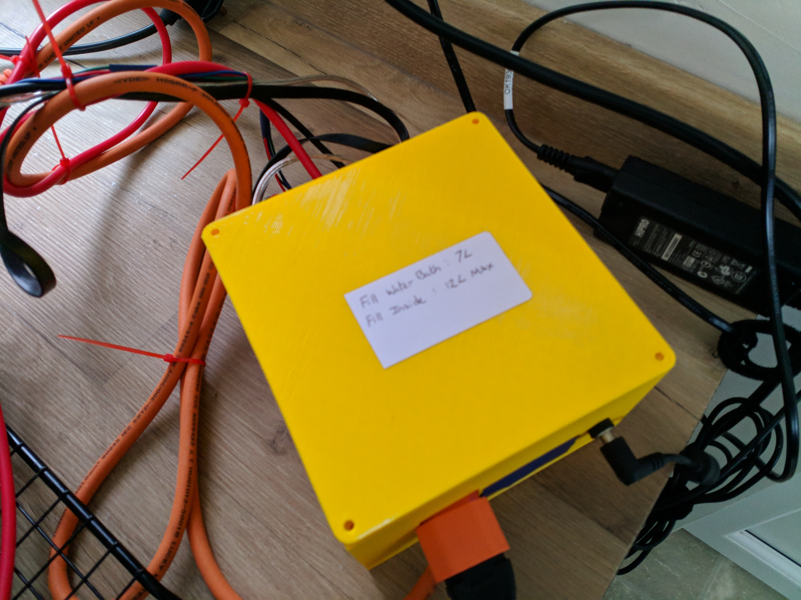
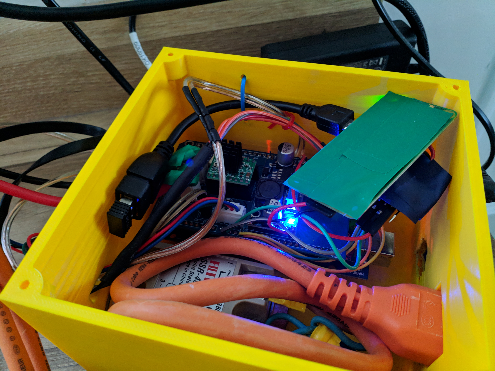
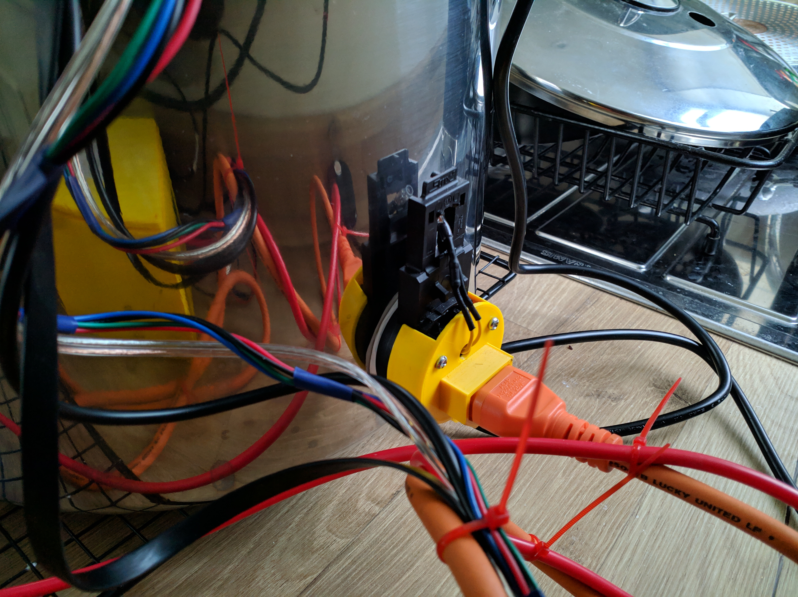
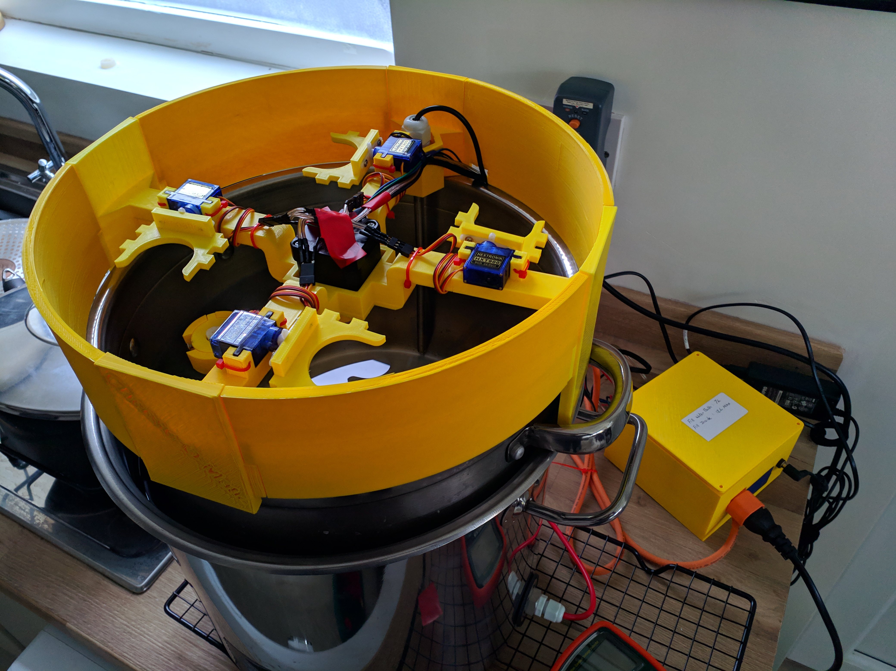

# CheeseMaker-3DParts

This repo contains all the 3D printable parts for the CheeseMaker.

## Hardware Case
The Hardware case houses the solid state relay, Arduino, printed circut board and the Raspberry Pi.

# Kettle Element Cap
The Kettle Element Cap is a covering for the raw 230V kettle element prongs. You could use the Cheese Maker without this part but it would be dangerous. Your Kettle element may have a different shape so YMMV.

# Stirrer Arm & Holder
The Stirrer holder holds the stepper motor that moves the stirrer arm. It also holds the 4 stepper motor ingredient dispensers and a thermowell for the milk temperature sensor.

The 4 outer wall segments are sized to fit the diameter of my pot and lid so may not fit your equipment. The rest of the holder however is adjustable in size and can be fixed to fit any size pot using some super glue.

